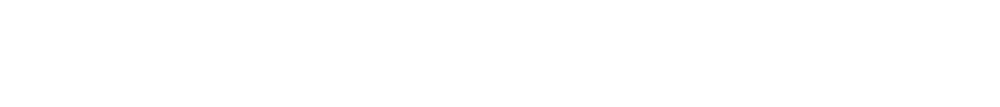
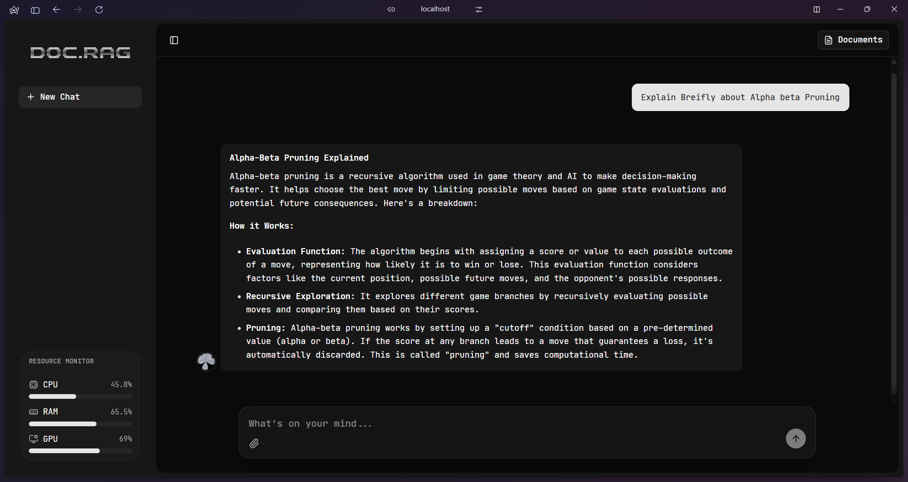

<!-- omit in toc -->

<p align="center">
  
</p>

<p align="center">
  Doc.RAG is a full-stack Retrieval-Augmented Generation application that lets you chat with PDF documents. It uses semantic search (FAISS), neural reranking, and Google Gemma 2:2b (via Ollama) to answer questions based on your uploaded documents. Built with Next.js, FastAPI, and SQLite. Perfect for learning about RAG pipelines, embeddings, and full-stack AI applications.
</p>


<p align="center">
  <a href="#getting-started">Getting Started</a> •
  <a href="#project-structure">Project Structure</a> •
  <a href="#credits">Credits</a>
</p>

<br>

<p align="center">
  
  
  
  
  
</p>

---

## Getting Started
> [!WARNING]
> ⚠️ Important Notice
>
> This project is a college project created primarily for learning purposes. It is not production-grade software. Please note the following:
>
> • Code may not be optimized or efficient  
> • Some functions/APIs may be hardcoded  
> • Error handling may be incomplete  
> • Not suitable for real-world deployment  
>
> This was built to learn and experiment with RAG, LLMs, and full-stack development.

### Screenshot

<p align="center">
  
</p>

### Prerequisites

- **Node.js** 18+
- **Python** 3.11+
- **Ollama** (for local LLM)
- **Tesseract OCR** (for scanned PDFs)

### Installation

```bash
# Frontend
cd rag-frontend && npm install

# Python dependencies
pip install fastapi uvicorn sqlalchemy pypdf pdf2image pytesseract faiss-cpu numpy sentence-transformers ollama requests psutil GPUtil pydantic

# Download LLM
ollama pull gemma2:2b
```

### Running

```bash
# Terminal 1: Backend
uvicorn main:app --reload --host 127.0.0.1 --port 8000

# Terminal 2: Frontend
cd rag-frontend && npm run dev
```

Open `http://localhost:3000`

---

## Project Structure

```
Project/
├── rag-frontend/              # Next.js frontend
│   ├── app/                  # App router pages
│   ├── components/           # React components
│   │   └── ui/              # shadcn/ui components
│   ├── context/              # React contexts
│   ├── hooks/                # Custom hooks
│   └── lib/                  # Utilities
│
├── backend/                  # Backend modules
│   ├── database.py           # Database configuration
│   └── models.py             # SQLAlchemy models
│
├── main.py                   # FastAPI application
├── rag_service.py            # RAG pipeline logic
├── vector_store.py           # FAISS vector operations
├── embedding_service.py      # Text embeddings
├── reranker_service.py       # Cross-encoder reranking
├── llm_service.py            # LLM integration
├── chunking.py              # Text chunking
└── AGENTS.md                # Developer guidelines
```

---

## Credits

**Frontend:** [Next.js](https://nextjs.org) • [React](https://react.dev) • [TypeScript](https://www.typescriptlang.org) • [Tailwind CSS](https://tailwindcss.com) • [shadcn/ui](https://ui.shadcn.com)

**Backend:** [FastAPI](https://fastapi.tiangolo.com) • [SQLAlchemy](https://www.sqlalchemy.org) • [SQLite](https://www.sqlite.org) • [FAISS](https://github.com/facebookresearch/faiss) • [Sentence-Transformers](https://sbert.net) • [pypdf](https://pypdf.readthedocs.io) • [Ollama](https://ollama.com) • [Google DeepMind Gemma](https://deepmind.google/models/gemma/)

---
